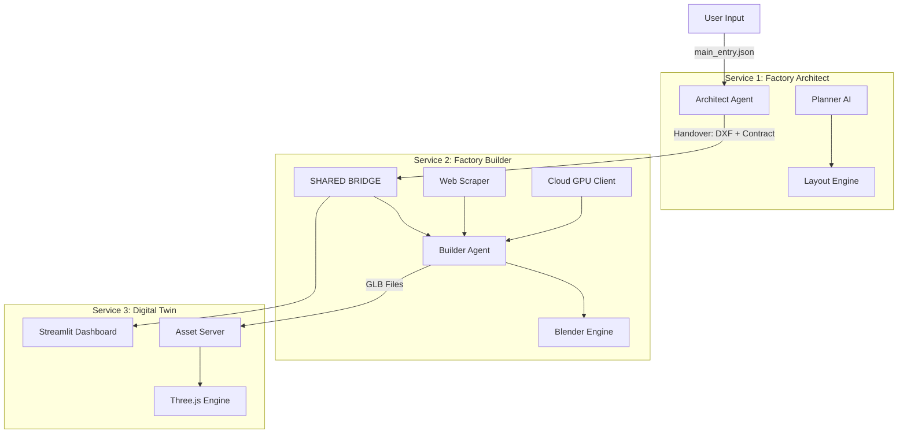

Here is the comprehensive documentation for the **AI Factory Generator**.

---

# 🏭 AI Factory Generator (Industry 5.0 Twin)

**From Text to Digital Reality: A Multi-Agent Industrial Pipeline**

The **AI Factory Generator** is an advanced generative pipeline that transforms unstructured project notes into a fully realized, 3D interactive factory simulation. It utilizes a Multi-Agent Architecture to bridge the gap between high-level industrial requirements and precise engineering visualization.

---

## 📖 Table of Contents

1.  [The Ideology & Philosophy](#-the-ideology--philosophy)
2.  [System Architecture](#-system-architecture)
3.  [The Data Lifecycle (The Protocol)](#-the-data-lifecycle-the-protocol)
4.  [Module Deep Dive](#-module-deep-dive)
    *   [1. Factory Architect (The Brain)](#1-factory-architect-the-brain)
    *   [2. Factory Builder (The Hands)](#2-factory-builder-the-hands)
    *   [3. Video Studio (The Lens)](#3-video-studio-the-lens)
    *   [4. Digital Twin (The Interface)](#4-digital-twin-the-interface)
5.  [Project Structure & File Guide](#-project-structure--file-guide)
6.  [Installation & Usage](#-installation--usage)

---

## 🧠 The Ideology & Philosophy

### 1. The Gap in Industrial Design
Traditional factory planning is disjointed. Process engineers write documents, architects draw CAD layouts, and 3D artists build visualizations. These steps are siloed, leading to version conflicts and data loss. This project aims to **unify** these stages into a single, continuous algorithmic flow.

### 2. Multi-Agent Specialization
Instead of one massive AI trying to do everything, this system employs specialized agents:
*   **The Architect** cares about logic, physics, and flow. It doesn't know about textures or cameras.
*   **The Builder** cares about aesthetics, assets, and geometry. It doesn't question the layout.
*   **The Twin** cares about user interaction and data visualization.

### 3. Data Sovereignty & The "Bridge"
A core design principle is the **Strict Separation of Concerns**.
*   **Private Contexts:** The Architect has its own private data folder. The Builder has its own. They cannot touch each other's files.
*   **The Shared Bridge:** The only way data moves from one stage to another is via a formal "Handover Protocol" into the `shared_data` directory. This acts as a contract. If the contract exists, the next stage begins.

---

## 🏗 System Architecture

The system runs as three orchestrated Docker containers sharing a specific volume structure.



---

## 🔄 The Data Lifecycle (The Protocol)

The pipeline enforces a strict directional flow of data.

### Phase 1: Ingestion & Planning (Private)
*   **Input:** `factory_architect/data/<Project>/input/main_entry.json`
*   **Action:** The Planner Agent reads raw text, extracts machines and relationships, and generates a structured JSON plan.
*   **Output:** `intermediate_plan.json` (Private).

### Phase 2: Architecture & Physics (Private)
*   **Action:** The Layout Agent takes the plan and applies physical rules (snake flow, spacing, port alignment). It generates a master DXF.
*   **Output:** `architecture.dxf` (Private Master).

### Phase 3: The Handover (Public)
*   **Action:** The Orchestrator "releases" the project. It copies the master DXF and generates a JSON contract.
*   **Output:** `shared_data/<Project>/layout.dxf` and `layout_contract.json`.
*   *Note:* `layout.dxf` is physically identical to `architecture.dxf`, but semantically different. It is the "Released Version."

### Phase 4: Construction (Private)
*   **Input:** Reads from `shared_data`.
*   **Action:** The Builder scrapes images, sends them to the Cloud GPU for 3D generation, and assembles the scene.
*   **Output:** `factory_builder/data/<Project>/scene/factory_complete.glb`.

### Phase 5: Visualization (Read-Only)
*   **Action:** The Twin reads the contract from `shared_data` and streams the GLB from the Builder's folder via a local asset server.

---

## 🔬 Module Deep Dive

### 1. Factory Architect (The Brain)
*   **Role:** Solves the topological and geometric puzzle.
*   **Core Logic:**
    *   **LLM Integration:** Uses Google Gemini to interpret vague project notes (e.g., "We need a shoe factory") into a list of machines and conveyor connections.
    *   **Layout Engine:** A custom physics engine that arranges nodes using "Manhattan Routing" (90-degree turns). It enforces a 1500mm safety clearance and ensures machines flow logically (Input -> Process -> Output).
    *   **DXF Renderer:** Uses `ezdxf` to write industry-standard CAD files. It embeds semantic metadata (Machine Names, IDs) into the DXF `XDATA` invisible layer.

### 2. Factory Builder (The Hands)
*   **Role:** Turns the DXF skeleton into a photorealistic 3D world.
*   **Core Logic:**
    *   **Asset Pipeline:** For every machine in the DXF:
        1.  **Scrape:** Finds a real-world reference image via Google Search.
        2.  **Generate:** Sends the image to a Cloud GPU (TripoSR/StableFast3D) to convert the 2D image into a 3D `.glb` model.
        3.  **Cache:** Stores assets in `factory_builder/data/<Project>/machines/<MachineName>/`.
    *   **Scene Composer:** Replaces the 2D DXF blocks with the generated 3D models. It automatically draws pipes and conveyors between machines using the path points calculated by the Architect.

### 3. Video Studio (The Lens)
*   **Role:** Automated cinematography.
*   **Core Logic:**
    *   **Smart Camera:** It analyzes the bounding box of every machine in the 3D scene to calculate the perfect camera angle (Position & Target).
    *   **Blender Engine:** It runs Blender in "Headless Mode" (Background) inside the Docker container.
    *   **Pathing:** It generates a B-Spline camera path that flies through the factory, following the production line order defined in the contract.
    *   **Output:** A cinematic `.mp4` flythrough.

### 4. Digital Twin (The Interface)
*   **Role:** User interaction and simulation.
*   **Core Logic:**
    *   **Asset Server:** A background thread that serves the raw GLB files to the frontend.
    *   **Streamlit & Three.js:** Uses a custom bidirectional bridge. Streamlit handles the UI controls (dropdowns, charts). When a user selects a machine, Streamlit sends a message to the embedded Three.js iframe to "Snap" the camera to that machine's coordinates.
    *   **Telemetry Sim:** Generates fake real-time data (Temperature, Vibration, OEE) for the dashboard.

---

## 📂 Project Structure & File Guide

```text
group2/
├── docker-compose.yml       # Orchestrates the 3 containers and volume mapping.
├── requirements.txt         # Global python dependencies.
│
├── factory_architect/       # [MODULE 1]
│   ├── Dockerfile           # Lightweight Python environment.
│   ├── data/                # PRIVATE DATA (Project Inputs/Outputs).
│   └── src/
│       ├── main.py          # Entry point (CLI).
│       ├── core/
│       │   └── context.py   # Manages paths and project lifecycle.
│       ├── services/
│       │   ├── ai_engine.py # Gemini wrapper (Planner & Layout agents).
│       │   └── orchestrator.py # Manages the Phase 1 -> Phase 2 -> Handover flow.
│       └── models/          # Pydantic schemas (Contracts).
│
├── factory_builder/         # [MODULE 2]
│   ├── Dockerfile           # Heavy environment (Blender + FFmpeg).
│   ├── data/                # PRIVATE DATA (Images, Models, Scenes).
│   ├── main.py              # Entry point.
│   └── services/
│       ├── video_studio/    # [NEW] Video Generation Logic.
│       │   ├── scripts/     # Python scripts that run INSIDE Blender.
│       │   └── manager.py   # Decides between Blender or AI video engines.
│       ├── web_scraper.py   # Downloads reference images.
│       ├── cloud_client.py  # Uploads images to GPU for 3D gen.
│       └── scene_composer.py# Merges GLBs and draws Pipes.
│
├── dashboard/               # [MODULE 3]
│   ├── Dockerfile           # Web environment.
│   ├── src/
│   │   ├── main.py          # Streamlit entry point.
│   │   ├── services/
│   │   │   └── asset_server.py # Background HTTP server for GLBs.
│   │   └── components/
│   │       └── viewer.py    # Python wrapper for Three.js.
│   └── assets/
│       └── viewer.html      # The actual 3D engine (JavaScript).
│
└── shared_data/             # THE BRIDGE (Mounted volume for inter-container communication).
```

---

## 🚀 Installation & Usage

### Prerequisites
1.  **Docker Desktop** installed.
2.  **Google Gemini API Key** (for the Architect).
3.  **Ngrok/Colab URL** (for the 3D Generation backend).

### Setup
1.  **Environment Variables:**
    Create a `.env` file in the root:
    ```env
    GOOGLE_API_KEY=AIzaSy...
    API_URL=https://your-gpu-backend.ngrok.io/generate
    ```

2.  **Clean Start:**
    Run the cleanup script to remove old data.
    ```bash
    # (Optional) Remove old data
    rm -rf shared_data factory_architect/data factory_builder/data
    ```

3.  **Build Containers:**
    ```bash
    docker compose build
    ```

### Running a Project
Let's build a factory called "Project_Alpha".

1.  **Define the Project:**
    Create the input folder and file.
    ```bash
    mkdir -p factory_architect/data/Project_Alpha/input
    # Paste your requirements into main_entry.json
    nano factory_architect/data/Project_Alpha/input/main_entry.json
    ```

2.  **Step 1: The Architect (Plan & Layout)**
    ```bash
    docker compose run --rm architect python -m src.main --project Project_Alpha
    ```
    *Result:* A DXF layout is generated and handed over to `shared_data`.

3.  **Step 2: The Builder (Construct & Film)**
    ```bash
    docker compose run --rm builder python -m main --project Project_Alpha
    ```
    *Result:* Images are scraped, models generated, scene assembled, and video rendered.

4.  **Step 3: The Twin (Visualize)**
    ```bash
    docker compose up twin
    ```
    *Result:* Open `http://localhost:8501`. Select "Project_Alpha" from the sidebar.

---

## 🎨 Design Decisions

*   **Docker Volumes vs. Copy:** We use volumes (`-v`) for data folders so that artifacts persist after the container dies. We use `COPY` for code in production to make images immutable.
*   **Headless Blender:** We use Blender as a Python module (`bpy`) inside Docker. This allows us to use professional cinematic tools (Camera constraints, Bezier curves) without needing a GUI.
*   **XDATA in DXF:** We embed data into the DXF files. This allows the DXF to be the "Source of Truth." Even if the JSON is lost, the DXF contains the Machine IDs required to reconstruct the scene.